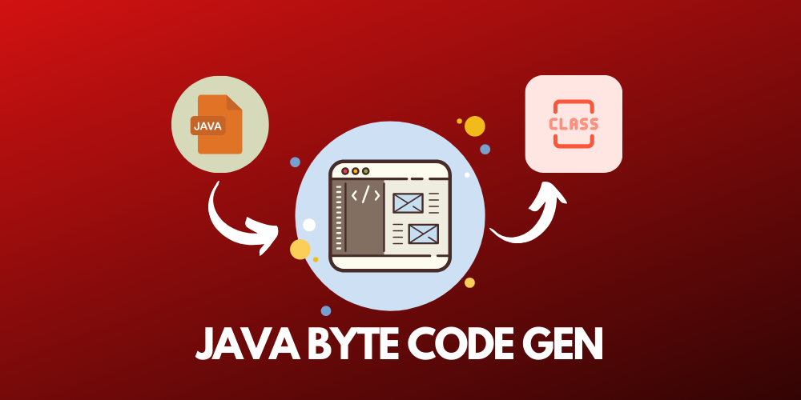

<h1 align='center'>Yet Another Java ByteCode Generator</h1>

Built using Flex & Bison to take in any java source code and emits its equivalent bytecode. This is a project developed for the PLT (**P**rogramming **L**anguage **T**ranslation) course at Faculty of Engineering, Alexandria University in Spring 2020 Offering.

## Resources

### Understanding Flex & Bison

- [Flex & Bison by John Levine. The definitive textbok for them.](http://web.iitd.ac.in/~sumeet/flex__bison.pdf)
- [Tutorial for complete novices needing to use Flex and Bison for some real project.](https://aquamentus.com/flex_bison.html)
- [Bison Official Doumentation.](https://www.cs.auckland.ac.nz/references/gnu/bison/bison_toc.html)
